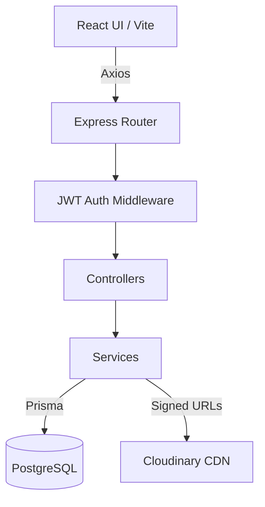
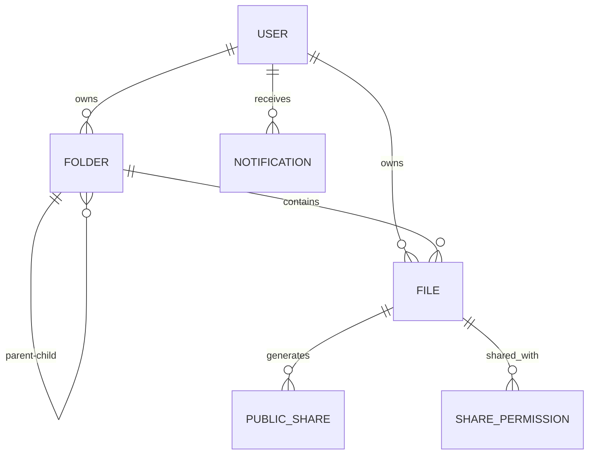

```
╭──────────────────────────────────────────────────────────╮
│  akash@sfit ~ %  whoami                                   │
╰──────────────────────────────────────────────────────────╯
```


<br>


<br><br>


<br><br>

<a href="mailto:aj0881871@gmail.com"></a>
<a href="https://profolio-akashjain.vercel.app/"></a>
<a href="https://www.linkedin.com/in/akash-yatin-jain"></a>
<a href="https://leetcode.com/u/Akashyatinjain/"></a>
<a href="https://github.com/Akashyatinjain"></a>

<br><br>

> 💡 **ENGINEERING PHILOSOPHY**
> *"I don't clone tutorials. I finish production-ready projects — from database schema design to deployment pipelines."*

<br>

```yaml
# ⚡ WHY ME? — QUICK ENGINEERING SNAPSHOT
Focus:          Backend & Systems Engineering
Track Record:   Built 4 Production-Ready Applications
Volume:         10,000+ Lines of Clean Code
Core Stack:     Node.js · Express · PostgreSQL · Prisma · Docker · Cloudinary
Core Domains:   Authentication · CI/CD · Architecture · Performance · Security
Current Role:   Joint Tech Lead @ IEEE SFIT
Target Role:    Software Engineering / Backend Engineering Internships (2026)
```

<br>

### 🧠 Architectural Decisions & Why I Chose Each Tool

| Technology | Why This Over Alternatives |
| :--- | :--- |
| **Node.js + Express** | Non-blocking I/O for async file streaming; lightweight enough for solo development velocity. |
| **PostgreSQL** | ACID compliance and relational integrity for nested folder trees — MongoDB can't enforce foreign keys. |
| **Prisma ORM** | Type-safe queries, auto-generated migrations, and SQL injection prevention out of the box. |
| **Cloudinary CDN** | Offloads binary storage to a global CDN — no disk management on a free-tier Render server. |
| **JWT + Google OAuth** | Stateless auth scales horizontally without server-side session stores. |
| **Docker** | Eliminates "works on my machine" — identical builds across local, CI, and production. |

<br>


```diff
+ $ ./run --project=datastock --mode=case-study
```

<div align="center">

<br><sub><i>A production-grade Google Drive clone — nested folders, JWT auth, Cloudinary storage, Dockerized deployment</i></sub>
</div>

<br>

#### 🎯 Problem
Tutorial cloud-storage apps store flat file arrays in MongoDB. Real platforms need **nested folder hierarchies**, **cascade deletions**, and **breadcrumb navigation** without N+1 query blowup.

#### 💡 Solution
Layered Express backend with **Prisma ORM** over **PostgreSQL**. Iterative folder-path resolution algorithm, Cloudinary signed-URL uploads, and JWT middleware across 18 protected routes.

<br>

### 🏗️ Architecture & Data Flow



### 🗄️ Database Schema (ERD)



<br>

### 🔌 Key API Endpoints

| Method | Endpoint | What It Does |
| :--- | :--- | :--- |
| `GET` | `/api/files` | Recursive folder tree listing with Prisma user-ID filtering |
| `POST` | `/api/upload` | Multipart stream → Cloudinary CDN → PostgreSQL index |
| `DELETE` | `/api/file/:id` | Cascade: verify owner → purge CDN asset → delete DB record |
| `PATCH` | `/api/file/star` | Atomic toggle with instant state revalidation |
| `GET` | `/api/search` | Index-backed full-text search across filenames & MIME types |

<br>

### 🛡️ Security Implemented

`JWT Auth` · `Google OAuth 2.0` · `bcrypt (10 rounds)` · `Helmet headers` · `express-rate-limit` · `CORS whitelist` · `Postman test suite`

<br>

### 📁 Project Structure

```
DataStock/
├── client/                 # React + Vite (60+ components)
│   ├── src/components/     # UI components & dashboard
│   └── src/services/       # Axios client & interceptors
└── server/                 # Express backend (90+ files)
    ├── controllers/        # Request validation
    ├── middleware/         # JWT auth & rate limiting
    ├── routes/             # API endpoints
    ├── services/           # Business logic & Cloudinary
    ├── utils/              # Folder tree algorithm
    └── prisma/             # Schema (6 models) & migrations
```

<br>

<div align="center">

<a href="https://data-stock.vercel.app/"></a>
&nbsp;&nbsp;
<a href="https://github.com/Akashyatinjain/DataStock"></a>

</div>

<br>


```diff
+ $ ls ./more-builds
```

| Project | Engineering Pitch | Live |
| :--- | :--- | :---: |
| `💰 finance-tracker` | Income/expense tracking, category analytics, CSV import, relational SQL. | [`run ▶`](https://budget-tracker-no3.vercel.app/) |
| `🌱 swasthya` | SIH finalist — wellness platform with protein calculator & recommendations. | [`run ▶`](https://sih-rho-liard.vercel.app/) |
| `📝 keeper-note` | Full CRUD note app with clean component isolation & dynamic state. | [`run ▶`](https://keeper-not-app.vercel.app/) |
| `🎮 simon-game` | Vanilla JS memory game — DOM manipulation & event-driven state machines. | [`run ▶`](https://akashyatinjain.github.io/Simon-Game/) |

<br>


```diff
+ $ cat achievements.log
```

- 🏆 **2nd Runner Up out of 50+ Teams** — Colloquium (SFIT technical & project competition)
- 🏆 **IEEE Joint Tech Lead** — SFIT Student Branch (workshops & mentoring 100+ students)
- 🏆 **Smart India Hackathon Finalist** — SWASTHYA Platform
- 🏆 **180+ LeetCode Problems Solved** — DSA & System Design focus
- 🏆 **45+ Day GitHub Streak** — 976+ contributions, daily code delivery

<br>


```diff
+ $ neofetch --stack
```

<div align="center">

<sub>**languages**</sub>
<br>
    

<br><br>

<sub>**frontend**</sub>
<br>
  

<br><br>

<sub>**backend & auth**</sub>
<br>
    

<br><br>

<sub>**databases & ORM**</sub>
<br>
  

<br><br>

<sub>**devops & cloud**</sub>
<br>
      

</div>

<br>


```diff
+ $ git log --stats --author=akash
```

<p align="center">


</p>
<p align="center">

</p>


<br>


<div align="center">

```
╭──────────────────────────────────────────────────────────╮
│  akash@sfit ~ %  ./contact --urgent                       │
│  > STATUS: ACTIVELY INTERVIEWING FOR 2026 SWE INTERNSHIPS │
╰──────────────────────────────────────────────────────────╯
```

> 🚀 **WHY HIRE ME?**
> *"I want to bring 'ship it end-to-end' ownership to a real team — database schemas, REST APIs, and deployment pipelines from Day 1."*

- 🎯 **Role:** SWE / Backend Engineering Internship (2026)
- ⚙️ **Focus:** Backend Systems | Full-Stack | Cloud
- 📍 **Location:** Remote | India

<br>

<a href="mailto:aj0881871@gmail.com"></a>
<a href="https://www.linkedin.com/in/akash-yatin-jain"></a>
<a href="https://profolio-akashjain.vercel.app/"></a>

<br><br>


</div>
