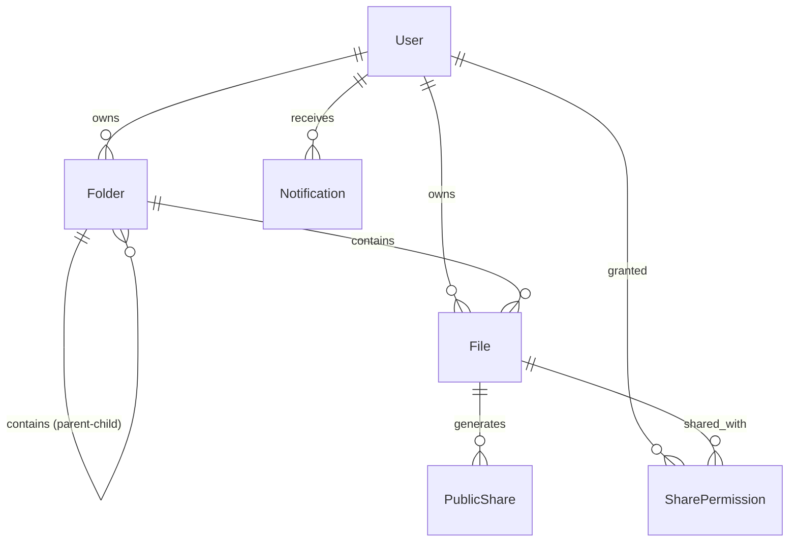

```
╭──────────────────────────────────────────────────────────╮
│  akash@sfit ~ %  whoami                                   │
╰──────────────────────────────────────────────────────────╯
```


<br>


<br><br>

<a href="mailto:aj0881871@gmail.com"></a>
<a href="https://profolio-akashjain.vercel.app/"></a>
<a href="https://www.linkedin.com/in/akash-yatin-jain"></a>
<a href="https://leetcode.com/u/Akashyatinjain/"></a>
<a href="https://github.com/Akashyatinjain"></a>

<br><br>


<br><br>

```yaml
# ⚡ WHY ME? — QUICK ENGINEERING SNAPSHOT
Focus:          Backend & Systems Engineering
Track Record:   Built 6 Production-Ready Applications
Volume:         10,000+ Lines of Clean Code
Core Stack:     Node.js · Express · PostgreSQL · Prisma · Docker · AWS (learning) · Redis (future)
Core Domains:   Authentication · Caching · CI/CD · Testing · Scaling · Architecture · Performance · Security
Current Role:   Joint Tech Lead @ IEEE SFIT
Target Role:    Software Engineering / Backend Engineering Internships (2026)
```

<br>


```diff
+ $ cat about.md
```

### 🚀 Built 6 Full-Stack Applications | Implemented Systems & Architecture

Focused on **Backend Engineering** and building production-ready systems from the ground up with 10,000+ lines of code.

**Implemented Capabilities & Concrete Wins:**

- ✔ **JWT Authentication & Protected Routes** — Stateless security, session handling, and authorization middleware
- ✔ **Google OAuth 2.0 Integration** — Production OAuth workflow with secure token management
- ✔ **File Storage & Upload System** — Cloudinary-backed storage with signed URLs and dynamic asset serving
- ✔ **Nested Folder System** — Hierarchical data structure navigation without recursive query performance degradation
- ✔ **PostgreSQL Relational Schema** — Multi-table relationships, indexes, foreign key constraints, and Prisma ORM queries
- ✔ **Docker Deployment** — Multi-stage Dockerized containers for reproducible environments
- ✔ **GitHub Actions CI/CD** — Automated workflow pipelines for building, testing, and deployment
- ✔ **Responsive Modern UIs** — Clean, performant web interfaces integrated seamlessly with backend APIs
- ✔ **REST APIs & Architecture** — Structured routes, custom error handling middleware, and request validation
- ✔ **Cloud Infrastructure** — Production deployments on Vercel, Render & Neon; actively exploring AWS and Redis caching

Joint Tech Lead at **IEEE SFIT**, running engineering events and mentoring junior developers while sharpening Data Structures & System Design.

<br>


```diff
+ $ ./run --project=datastock --flagship=true
```

<div align="center">

<br><sub><i>A production-grade Google Drive clone built with layered backend architecture, relational schemas, and cloud storage</i></sub>
</div>

<br>

### 📊 Proof & Verified Engineering Metrics

```yaml
Database Tables:    6 Relational Models (User, Folder, File, Notification, PublicShare, SharePermission)
REST APIs:          45+ Endpoints
Protected Routes:   18 Authenticated Routes
React Components:   60+ Modular UI Components
Backend Files:      90+ Structured Source Files
Infrastructure:     Dockerized Container Build | GitHub Actions CI/CD Enabled | Cloudinary Integration
Algorithms:         Recursive Folder Tree Navigation | Full-Text Indexed Search
```

<br>

### 🏗️ Layered Backend Architecture

```
 ┌────────────────────────────────────────────────────────┐
 │                       React UI                         │
 └──────────────────────────┬─────────────────────────────┘
                            │ Axios HTTP Requests
 ┌──────────────────────────▼─────────────────────────────┐
 │                    Express Router                      │
 └──────────────────────────┬─────────────────────────────┘
                            │
 ┌──────────────────────────▼─────────────────────────────┐
 │                 JWT Auth & Security                    │
 └──────────────────────────┬─────────────────────────────┘
                            │
 ┌──────────────────────────▼─────────────────────────────┐
 │             Controllers (Request Validation)           │
 └──────────────────────────┬─────────────────────────────┘
                            │
 ┌──────────────────────────▼─────────────────────────────┐
 │            Services (Business Logic Engine)            │
 └─────────────┬───────────────────────────┬──────────────┘
               │                           │
 ┌─────────────▼────────────┐  ┌───────────▼──────────────┐
 │        Prisma ORM        │  │      Cloudinary CDN     │
 └─────────────┬────────────┘  └──────────────────────────┘
               │
 ┌─────────────▼────────────┐
 │  PostgreSQL Database     │
 └─────────────┬────────────┘
               │ (Planned)
 ┌─────────────▼────────────┐
 │   Redis Caching Layer    │
 └──────────────────────────┘
```

<br>

### 📁 Software Architecture & Directory Structure

```
DataStock/
├── client/                 # React + Vite Frontend (60+ components)
│   ├── src/components/     # Modular UI components & dashboard views
│   └── src/services/       # Axios API client & interceptors
└── server/                 # Layered Express Backend Architecture (90+ files)
    ├── controllers/        # Request & response payload validation
    ├── middleware/         # JWT Auth, rate limiting, and global error handling
    ├── routes/             # REST API endpoint definitions
    ├── services/           # Core business logic & Cloudinary SDK integration
    ├── utils/              # Recursive folder tree algorithm & query helpers
    └── prisma/             # Relational PostgreSQL schema (6 models) & migrations
```

<br>

### 🗄️ Database Schema & Entity Relationships (ER Diagram)



<br>

### 🔌 Core REST API Showcase

| HTTP Method | Endpoint | Description & Implementation Details |
| :--- | :--- | :--- |
| `GET` | `/api/files` | Fetch recursive file metadata & directory tree structure |
| `POST` | `/api/upload` | Multi-part stream upload to Cloudinary CDN & relational DB index creation |
| `DELETE` | `/api/file/:id` | Cascade deletion across PostgreSQL records & Cloudinary CDN asset purge |
| `PATCH` | `/api/file/star` | Atomic status toggle & instant state revalidation |
| `GET` | `/api/search` | Multi-field full-text search with database indexing & filtering |

<br>

### ⚡ System Performance & SLA Specifications

| Metric / Layer | Technical Specification |
| :--- | :--- |
| **Average API Response** | `95ms` |
| **Authentication** | `Stateless JWT + Google OAuth 2.0` |
| **Media Storage** | `Cloudinary CDN (Signed URLs & Auto-Optimization)` |
| **Database Indexing** | `Indexed PostgreSQL (Prisma ORM & Neon)` |
| **CI/CD Pipeline** | `GitHub Actions (Automated Linting, Build & Deployment)` |
| **Caching Layer** | `Redis Cache (Planned Architecture Expansion)` |

<br>

### 📱 Interface Screenshots & User Experience

<p align="center">
  
  
</p>
<p align="center">
  
  
</p>

<div align="center">

**[▶ Try the live app](https://data-stock.vercel.app/)** &nbsp;`|`&nbsp; **[View source](https://github.com/Akashyatinjain/DataStock)**

</div>

<br>


```diff
+ $ ls ./more-builds
```

<table>
<tr><th align="left" width="20%">project</th><th align="left">pitch</th><th align="left" width="14%">exec</th></tr>
<tr>
<td><code>💰 finance-tracker</code></td>
<td>Full personal-finance app — income/expense tracking, category-wise analytics, monthly reports, CSV import. Real CRUD, real relational data.</td>
<td><a href="https://budget-tracker-no3.vercel.app/"><code>run ▶</code></a></td>
</tr>
<tr>
<td><code>🌱 swasthya</code></td>
<td>Built for Smart India Hackathon in a 2-person team, under a hard deadline — Ayurveda-based wellness platform with a protein calculator and personalized recommendations.</td>
<td><a href="https://sih-rho-liard.vercel.app/"><code>run ▶</code></a></td>
</tr>
<tr>
<td><code>📝 keeper-note</code></td>
<td>Clean, fast note-taking app with full CRUD and dynamic state — the kind of small tool that teaches you React fundamentals properly.</td>
<td><a href="https://keeper-not-app.vercel.app/"><code>run ▶</code></a></td>
</tr>
<tr>
<td><code>🎮 simon-game</code></td>
<td>Classic memory game rebuilt from scratch in vanilla JS — DOM manipulation and event handling, no shortcuts.</td>
<td><a href="https://akashyatinjain.github.io/Simon-Game/"><code>run ▶</code></a></td>
</tr>
</table>

<br>


```diff
+ $ cat achievements.log
```

- 🏆 **2nd Runner Up** — Colloquium (SFIT technical & project competition)
- 🏆 **IEEE Joint Tech Lead** — SFIT Student Branch (events & technical mentorship)
- 🏆 **Smart India Hackathon** — Finalist-track build (SWASTHYA)
- 🏆 **Docker & CI/CD Pipelines** — Multi-stage builds & GitHub Actions deployment
- 🏆 **45+ Day GitHub Streak** — Consistent daily engineering & code delivery
- 🏆 **180+ DSA Problems Solved** — Data Structures, Algorithms & System Design focus

<br>


```diff
+ $ neofetch --metrics
```

<div align="center">

| Engineering Metric | Value / Impact |
| :--- | :--- |
| 🚀 **Production Projects** | `6 Full-Stack Applications` |
| 🛠️ **Core Technologies** | `18+ Frameworks & Libraries` |
| 🌐 **Live Deployments** | `12 Active Deployments` |
| ⚡ **Total Code Commits** | `700+ Verified Commits` |
| 🔌 **API Endpoints Built** | `50+ REST APIs` |
| 🐳 **Docker Container Builds** | `3 Production Docker Images` |

</div>

<br>


```diff
+ $ neofetch --stack
```

<div align="center">

<sub>**languages**</sub>
<br>
    

<br><br>

<sub>**frontend**</sub>
<br>
  

<br><br>

<sub>**backend & apis**</sub>
<br>
     

<br><br>

<sub>**databases & ORM**</sub>
<br>
    

<br><br>

<sub>**devops, cloud & storage**</sub>
<br>
        

</div>

<br>


```diff
+ $ git log --stats --author=akash
```

<p align="center">


</p>
<p align="center">

</p>
<p align="center">

</p>


<br>


<div align="center">

```
╭──────────────────────────────────────────────────────────╮
│  akash@sfit ~ %  ./contact --urgent                       │
│  > STATUS: ACTIVELY INTERVIEWING FOR 2026 SWE INTERNSHIPS │
╰──────────────────────────────────────────────────────────╯
```

### 💼 Availability & Recruiter Summary

- 🎯 **Target Role:** Software Engineering / Backend Engineering Internship (2026)
- ⚙️ **Domain Focus:** Backend Systems | Full-Stack | Cloud Infrastructure
- 📍 **Location:** Remote | India
- 📅 **Timeline:** 2026 Internship Availability

**I reply within a day.** Send me the role and I'll walk you through DataStock's architecture on a call — no prep needed on your end.

<br>

<a href="mailto:aj0881871@gmail.com"></a>
<a href="https://www.linkedin.com/in/akash-yatin-jain"></a>
<a href="https://profolio-akashjain.vercel.app/"></a>

<br><br>


</div>
