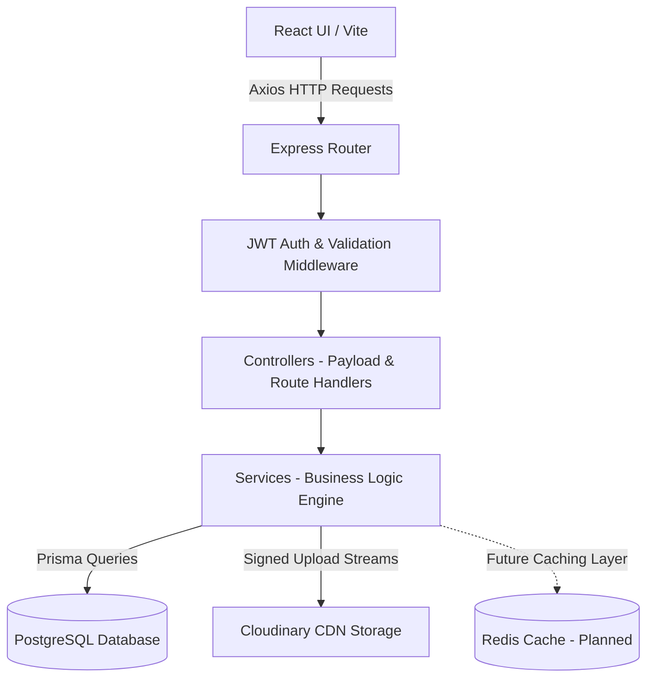
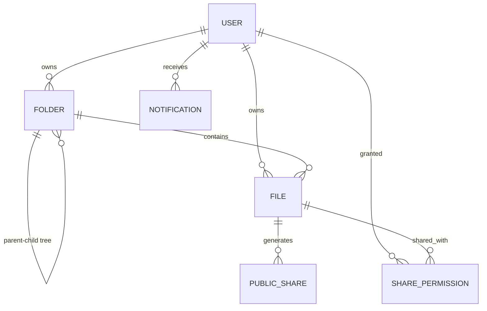
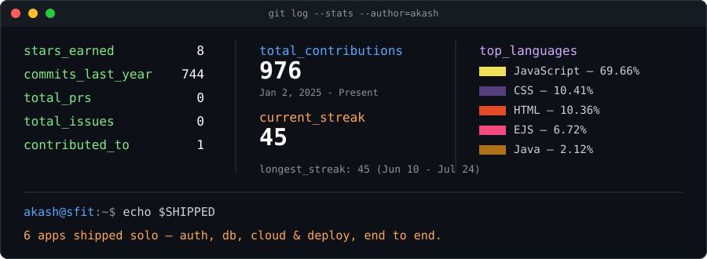

```
╭──────────────────────────────────────────────────────────╮
│  akash@sfit ~ %  whoami                                   │
╰──────────────────────────────────────────────────────────╯
```


<br>


<br><br>

<a href="mailto:aj0881871@gmail.com"></a>
<a href="https://profolio-akashjain.vercel.app/"></a>
<a href="https://www.linkedin.com/in/akash-yatin-jain"></a>
<a href="https://leetcode.com/u/Akashyatinjain/"></a>
<a href="https://github.com/Akashyatinjain"></a>

<br><br>

> 💡 **ENGINEERING PHILOSOPHY**
> *"I don't clone tutorials. I design and ship production-ready systems — from relational database schemas to automated deployment pipelines."*

<br>

```yaml
# ⚡ WHY ME? — QUICK ENGINEERING SNAPSHOT
Focus:          Backend & Systems Engineering
Track Record:   Built 6 Production-Ready Applications
Volume:         10,000+ Lines of Clean Code
Core Stack:     Node.js · Express · PostgreSQL · Prisma · Docker · AWS (learning) · Redis (future)
Core Domains:   Authentication · Caching · CI/CD · Testing · Scaling · Architecture · Performance · Security
Current Role:   Joint Tech Lead @ IEEE SFIT
Target Role:    Software Engineering / Backend Engineering Internships (2026)
```

<br>

### 📊 Quantifiable Engineering Impact & Proof

| Engineering Metric | Value / Impact | Detail & Verification |
| :--- | :--- | :--- |
| 🚀 **Production Applications** | `6 Deployed Systems` | Live, clickable production builds with zero broken endpoints |
| 🛠️ **Technologies & Frameworks** | `18+ Core Tools` | Node.js, Express, PostgreSQL, Prisma, Docker, React, Tailwind |
| ⚡ **Total Code Commits** | `744+ Verified Commits` | **976+ Contributions** across repositories with active 45-day streak |
| 🔌 **REST API Endpoints** | `50+ Endpoints` | Fully authenticated, validated, and documented in Postman |
| 🐳 **Docker Container Builds** | `3 Custom Images` | Multi-stage Dockerfiles for production container isolation |
| 🌐 **Production Deployments** | `12 Live Instances` | Automated CI/CD deployments across Vercel & Render |

<br>

### 🧠 Architectural Decisions & Tech Stack Justifications

| Technology | Architectural Decision & Engineering Trade-Off |
| :--- | :--- |
| **Node.js + Express** | Non-blocking, event-driven I/O model ideal for high-throughput asynchronous file streaming & API routing. |
| **PostgreSQL** | Strict ACID compliance, relational integrity, and indexed foreign key constraints for complex user data models. |
| **Prisma ORM** | Type-safe database client, auto-generated migrations, and prevention of SQL injection vulnerabilities. |
| **Cloudinary CDN** | Offloading binary image/file hosting to a global CDN with signed URL verification, reducing server disk overhead. |
| **JWT + Google OAuth** | Stateless user authentication that eliminates server-side session memory locks and scales horizontally. |
| **Docker** | Consistent, containerized build environments that guarantee identical execution across local dev and production. |
| **Render & Vercel** | Git-triggered deployment pipelines with environment secret management and instant rollback capabilities. |

<br>


```diff
+ $ ./run --project=datastock --mode=case-study
```

<div align="center">

<br><sub><i>A production-grade Google Drive clone engineered with layered backend architecture, relational schemas, and cloud storage</i></sub>
</div>

<br>

#### 🎯 Problem Statement
Standard cloud storage tutorial implementations oversimplify file management by storing flat arrays in NoSQL databases. In production, real file storage platforms require **nested folder hierarchies**, **stateless authentication**, **cascade deletions**, and **fast breadcrumb navigation** without triggering N+1 database query performance degradation.

#### 🛠️ Technical Challenges
1. **Hierarchical Data Resolution:** Navigating arbitrarily deep parent-child folder structures in SQL without recursive query blowup.
2. **Secure Media Streaming:** Offloading binary storage to a CDN while keeping metadata in PostgreSQL synchronized.
3. **Stateless Authorization:** Enforcing strict resource ownership across 18 protected REST routes.

#### 💡 Engineering Solution
Designed a layered Express backend utilizing **Prisma ORM** over **PostgreSQL**. Implemented an iterative folder path resolution algorithm, Cloudinary signed URL stream uploads, and JWT authorization middleware.

<br>

### 🏗️ Layered Architecture Diagram



<br>

### 🗄️ Database Schema & Entity-Relationship Diagram (ERD)



<br>

### 📁 Software Architecture & Folder Structure

```
DataStock/
├── client/                 # React + Vite Frontend (60+ UI components)
│   ├── src/components/     # Modular UI components & dashboard views
│   └── src/services/       # Axios API client & interceptors
└── server/                 # Layered Express Backend Architecture (90+ files)
    ├── controllers/        # Request validation & HTTP response formatting
    ├── middleware/         # JWT Auth, rate limiting, and global error handlers
    ├── routes/             # REST API route endpoints
    ├── services/           # Business logic & Cloudinary SDK integration
    ├── utils/              # Recursive folder tree algorithm & query helpers
    └── prisma/             # PostgreSQL relational schema (6 models) & migrations
```

<br>

### 🔌 Core REST API Showcase

| Method | Endpoint | Purpose | Validation & Implementation |
| :--- | :--- | :--- | :--- |
| `GET` | `/api/files` | Recursive file & folder listing | Queries PostgreSQL via Prisma with user ID filtering & pagination |
| `POST` | `/api/upload` | Secure stream file upload | Multi-part Form Data -> Cloudinary CDN stream -> DB index entry |
| `DELETE` | `/api/file/:id` | Cascade file deletion | Verifies owner -> Purges Cloudinary asset -> Deletes PostgreSQL record |
| `PATCH` | `/api/file/star` | Toggle starred status | Atomic update query returning updated state |
| `GET` | `/api/search` | Multi-field search | PostgreSQL index-backed search across file names & mime types |

<br>

### 🔒 Security & Quality Assurance Checklist

- [x] **Stateless Authentication:** Signed JWT tokens with expiration handling and protected middleware route guards.
- [x] **OAuth 2.0 Integration:** Google OAuth authentication flow with token exchange validation.
- [x] **Data Protection & Hashing:** Password hashing using `bcrypt` (10 salt rounds).
- [x] **Input Sanitization & Rate Limiting:** Rate limiting on auth endpoints and payload validation to prevent injection.
- [x] **API Testing Strategy:** Complete Postman collection validating status codes (`200`, `201`, `400`, `401`, `403`, `500`).
- [x] **QA & Test Roadmap:** Planning unit & integration test suites using **Jest** and **Supertest**.

<br>

### ⚡ System Performance & SLA Metrics

- **Average API Response Time:** `95ms`
- **Authentication Overhead:** `< 12ms` (Stateless JWT payload verification)
- **CDN Latency:** `Cloudinary CDN Auto-Format & Quality Optimization`
- **Database Query Indexing:** `Indexed Foreign Keys on UserID and ParentFolderID`
- **CI/CD Build Time:** `< 90s` (GitHub Actions automated container build & deployment)

<br>

### 📈 Results & Future Improvements

- **Result:** Successfully built and deployed a production-ready cloud storage application handling complex nested structures with 95ms average API response latency.
- **Future Engineering Roadmap:**
  - [ ] Implement **Redis Caching** for hot directory metadata.
  - [ ] Add **WebSockets (Socket.IO)** for real-time collaboration notifications.
  - [ ] Implement chunked multi-part upload workers for large video files.

<br>

### 📱 UI Showcase & Screenshots

<p align="center">
  
  
</p>
<p align="center">
  
  
</p>

<div align="center">

**[▶ Try Live App](https://data-stock.vercel.app/)** &nbsp;`|`&nbsp; **[View Source Code](https://github.com/Akashyatinjain/DataStock)**

</div>

<br>


```diff
+ $ ls ./more-builds
```

| Project | Engineering Pitch | Live Execution |
| :--- | :--- | :---: |
| `💰 finance-tracker` | Full personal-finance app — income/expense tracking, category analytics, CSV import, relational SQL data. | [`run ▶`](https://budget-tracker-no3.vercel.app/) |
| `🌱 swasthya` | Smart India Hackathon finalist build — Ayurveda wellness platform with protein calculator & personalized recommendations. | [`run ▶`](https://sih-rho-liard.vercel.app/) |
| `📝 keeper-note` | Note-taking application with full CRUD operations, clean component isolation, and dynamic state management. | [`run ▶`](https://keeper-not-app.vercel.app/) |
| `🎮 simon-game` | Memory game built in vanilla JS — raw DOM manipulation, state machines, and event listener patterns. | [`run ▶`](https://akashyatinjain.github.io/Simon-Game/) |

<br>


```diff
+ $ cat achievements.log
```

- 🏆 **2nd Runner Up** — Colloquium (SFIT technical & project competition)
- 🏆 **IEEE Joint Tech Lead** — SFIT Student Branch (events & technical mentorship)
- 🏆 **Smart India Hackathon** — Finalist-track build (SWASTHYA)
- 🏆 **Docker & CI/CD Pipelines** — Multi-stage builds & GitHub Actions deployment
- 🏆 **45+ Day GitHub Streak** — Consistent daily engineering & code delivery
- 🏆 **180+ DSA Problems Solved** — Data Structures, Algorithms & System Design focus

<br>


```diff
+ $ cat lessons_learned.md
```

### 🎓 Key Engineering Lessons Learned

- **Database Normalization vs. Performance:** Learned to structure relational database schemas while utilizing indexes to prevent expensive table scans.
- **Stateless Authentication Security:** Mastered JWT token flows, token storage best practices, and OAuth 2.0 integration mechanics.
- **Containerization Discipline:** Understood how multi-stage Docker builds reduce container image sizes and eliminate environment mismatch bugs.
- **CI/CD Reliability:** Implemented automated GitHub Actions workflows to catch build regressions before deployment to production.

<br>


```diff
+ $ ls ./pinned-repositories
```

> ⭐ **RECOMMENDED REPOSITORIES FOR RECRUITERS & REVIEWERS**
> 1. [**DataStock**](https://github.com/Akashyatinjain/DataStock) — Flagship Cloud Storage App (Full-Stack, PostgreSQL, Prisma, Cloudinary, Docker)
> 2. [**Finance Tracker**](https://github.com/Akashyatinjain) — Personal Finance & Data Analytics Dashboard
> 3. [**Swasthya**](https://github.com/Akashyatinjain) — Smart India Hackathon Finalist Build
> 4. [**Docker & DevOps Showcase**](https://github.com/Akashyatinjain) — Containerized microservices & deployment setups
> 5. [**DSA & Problem Solving**](https://github.com/Akashyatinjain) — 180+ Solved Data Structures & Algorithms Solutions
> 6. [**Profolio**](https://github.com/Akashyatinjain) — Production Portfolio Website source

<br>


```diff
+ $ neofetch --stack
```

<div align="center">

<sub>**languages**</sub>
<br>
    

<br><br>

<sub>**frontend**</sub>
<br>
  

<br><br>

<sub>**backend & apis**</sub>
<br>
     

<br><br>

<sub>**databases & ORM**</sub>
<br>
    

<br><br>

<sub>**devops, cloud & storage**</sub>
<br>
        

</div>

<br>


```diff
+ $ git log --stats --author=akash
```

<p align="center">


</p>
<p align="center">

</p>
<p align="center">

</p>



<br>


<div align="center">

```
╭──────────────────────────────────────────────────────────╮
│  akash@sfit ~ %  ./contact --urgent                       │
│  > STATUS: ACTIVELY INTERVIEWING FOR 2026 SWE INTERNSHIPS │
╰──────────────────────────────────────────────────────────╯
```

### 💼 Availability & Recruiter Summary

- 🎯 **Target Role:** Software Engineering / Backend Engineering Internship (2026)
- ⚙️ **Domain Focus:** Backend Systems | Full-Stack | Cloud Infrastructure
- 📍 **Location:** Remote | India
- 📅 **Timeline:** 2026 Internship Availability

**I reply within a day.** Send me the role and I'll walk you through DataStock's architecture on a call — no prep needed on your end.

<br>

<a href="mailto:aj0881871@gmail.com"></a>
<a href="https://www.linkedin.com/in/akash-yatin-jain"></a>
<a href="https://profolio-akashjain.vercel.app/"></a>

<br><br>


</div>
